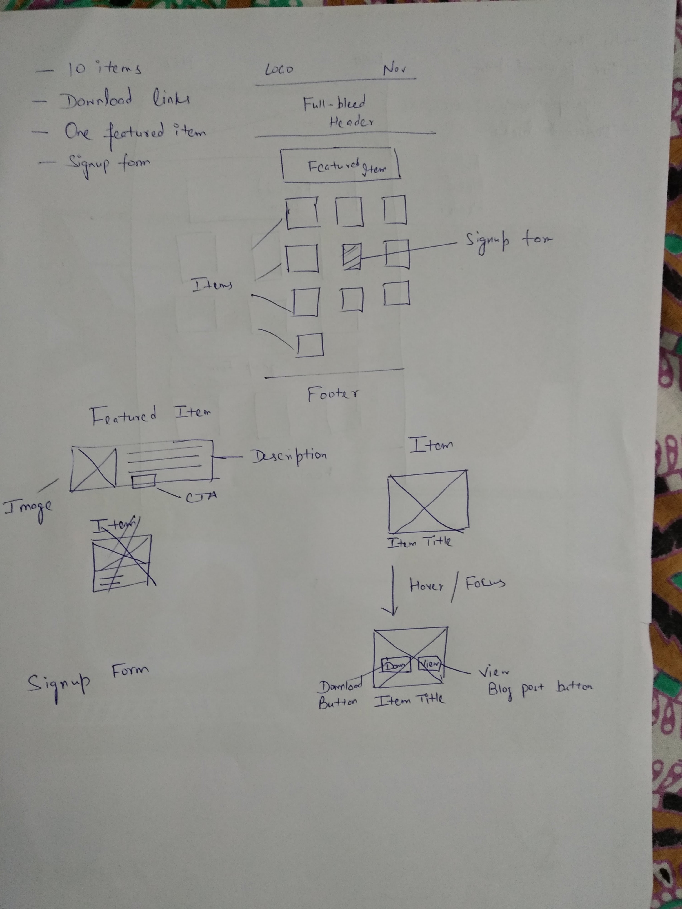
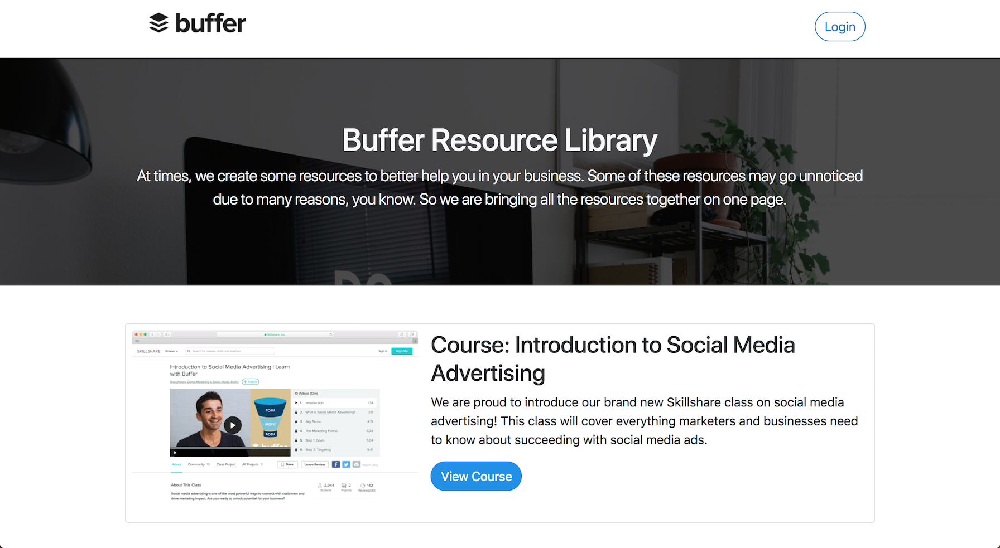

Hello Buffer :-)
I've always been a fan of your team and would've loved to join any position. But, yesterday I saw the opportunity to join your team as Marketing Engineer.
I just couldn't stop myself from thinking: "This position is made for me."
Because...
I am an engineer as well as a marketer.
I was marketer in the early stage of my career and just last year switched to frontend development after trying my luck at marketer. (Sad story, don't want to go there ;-)
So I just couldn't control myself.
I printed the application and scanned the entire job posting word-by-word. And made a plan to crack this job
The problem is, I've nothing to show in my portfolio apart from 2-3 webpages. And the application is closing today (28th Feb).
So, I am asking one favor from you guys, just give me 9 more days. Review my application on the last day i.e., 9th March.
Becasue for these 9 days I will be building apps, pages, and websites for Buffer.

#### Project One : Buffer Resource Library

My project building journey started today.
Today, I visited some of your popular blog posts. I found that some of your blog posts had an exclusive bonus that readers can download free of cost.
So, I thought why not combine all these resources in one page where people can download them in one-go.
Like Hubspot and CoSchedule:
1[Hubspot and CoSchedule Resources Page](../images/hubspot-coschedule-resource-page.png)
I searched in Google and created a spreadsheet of all the resources created by you. Then, I quickly opened my notepad and created a very quick wireframe for it.

However, the final product ended up look a bit different than my wireframe. I built the page with Bootstrap and some custom styling on top.

So, that's my first project. You can [view it here](https://madebyaman.github.io/buffer-resource-library/) by visiting the link.
In future, I can add a functionality to filter through the list and maybe require subscribing before downloading the resource.
